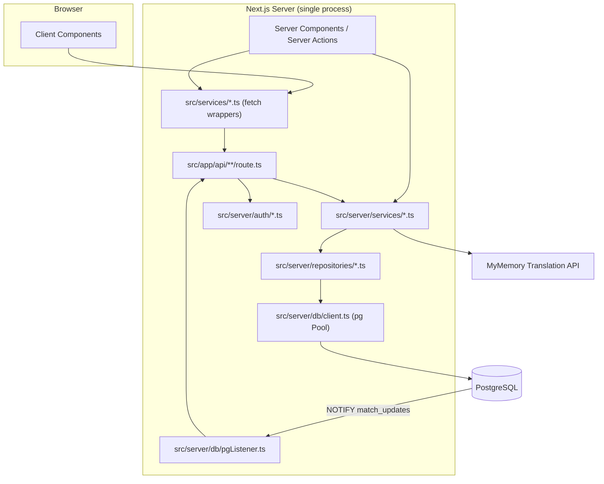
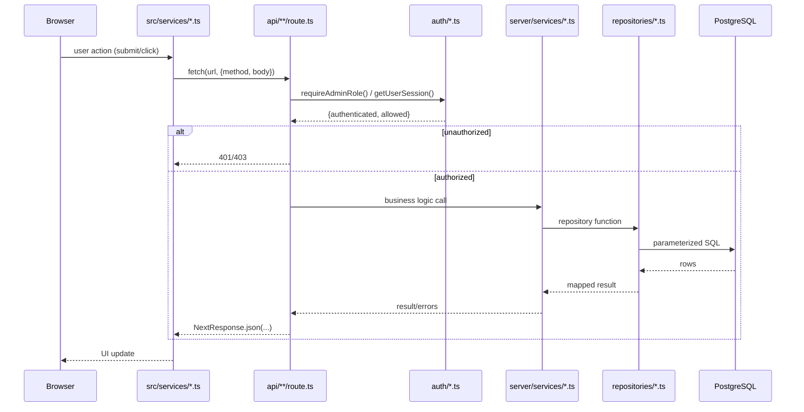
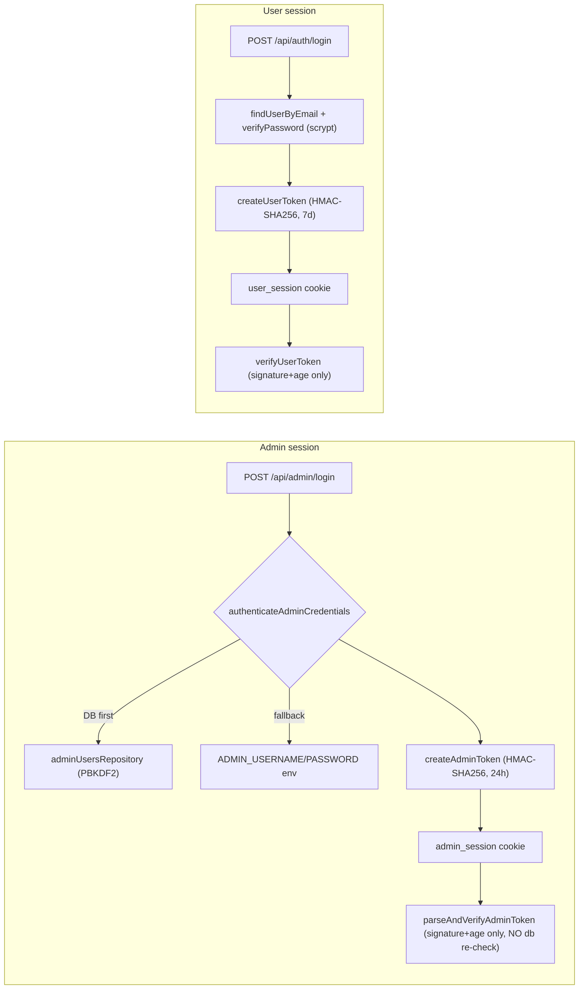
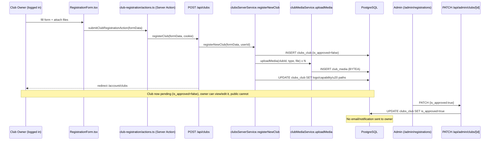
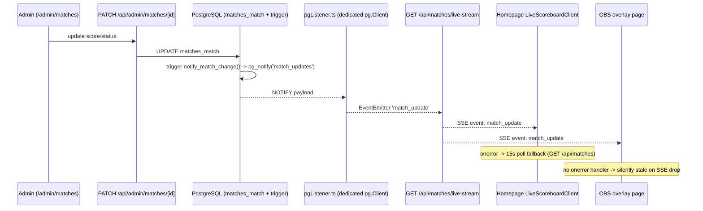
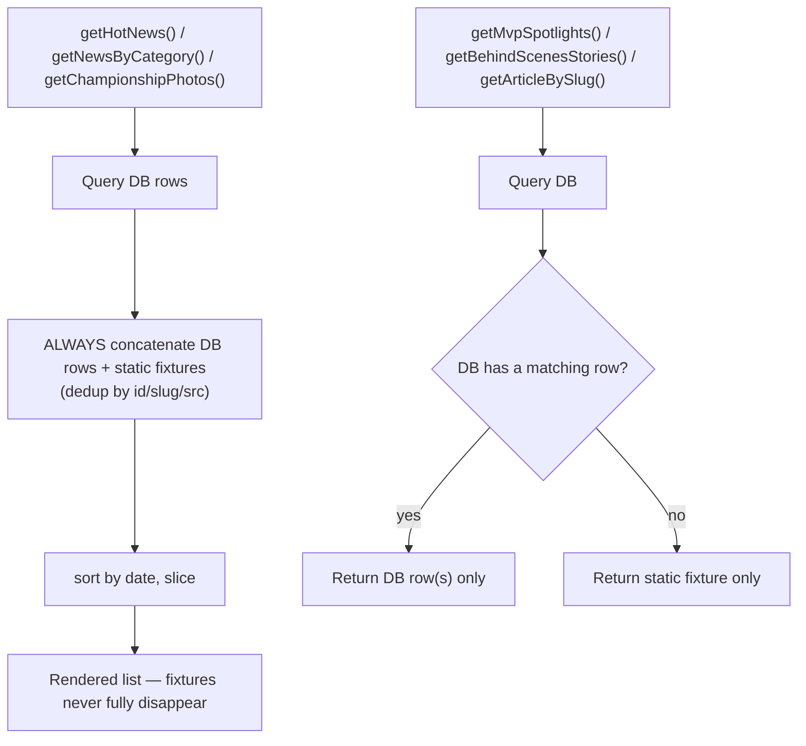

# NGWH (NextGen Women Hoops) — Project Workflow & Architecture Audit

**Generated**: 2026-09-03 · **Last updated**: 2026-09-03 (implementation pass, see §22) · **Scope**: full repository, source-code-first · **App root**: `root-NGWH/` (paths below are relative to it unless prefixed otherwise)

> **Which codebase this describes**: `/home/giahoang/dev/basketball-web/root-NGWH` — the Next.js + SCSS + Jest + `schemaInit.ts` application. It does **not** describe the sibling `/home/giahoang/dev/ngwh` project (Next.js 16 + Tailwind v4 + Sanity + `node --test` + numbered SQL migrations), even though a copy of this file currently lives in that project's `.ai/` directory. Nothing named in this document (`schemaInit.ts`, `adminAuth.ts`, `pgListener.ts`, `heroRepository.ts`, `getHotNews`, the SSE pipeline, `hero_slides`) exists in `ngwh`. Check which directory you are in before acting on anything here.

> Methodology note: every claim in this document is backed by a direct read of the file(s) named next to it. Where `.ai/*.md`/`CLAUDE.md`/`README.md` were consulted, they are treated as historical/aspirational, not authoritative — Section 19 records every place they diverge from what the code actually does. Nothing here was inferred from documentation alone.

---

## 1. Executive Summary

NGWH is a single Next.js 16.3.1 (App Router) + React 19.2.8 application that serves both the public marketing/tournament site and its own backend, talking to PostgreSQL directly via the `pg` driver — there is no ORM, no separate backend process, and no formal migrations system (schema lives entirely in one idempotent bootstrap function, `ensureDatabaseSchema()`, invoked lazily on first DB access). Two independent, hand-rolled HMAC-token session systems exist (`admin_session` for admin/subadmin, `user_session` for club owners/public accounts). Real-time live-match scores flow through a genuinely working PostgreSQL `LISTEN`/`NOTIFY` → SSE pipeline consumed by both the homepage and a dedicated OBS overlay page. Content for News and Gallery follows a DB-first pattern with static fixtures as demo content. As of the §22 implementation pass this is uniform: every section shows real rows when it has any, and fixtures only while it is empty (or while the database is unreachable). Previously News and Championship Photos concatenated fixtures with real rows on every request, contradicting both `CLAUDE.md` and the two Gallery sections that already behaved correctly.

The codebase is generally consistent (no ORM drift, FK constraints are real, parameterized queries throughout). Two live defects recorded by the original audit have since been fixed: `schemaInit.ts`'s `hero_slides` definition lacks `created_at`/`updated_at` while `heroRepository.ts` queried them (the repository now matches the canonical schema), and admin sessions are now re-validated against the database on every request so disabling an account takes effect immediately instead of at the token's natural 24h expiry. Multi-statement writes that were non-atomic — club registration with its media, and full-roster replacement — now run inside a real transaction.

Total business workflows traced end-to-end: **28** (Section 12). Full status classification: Section 13. Documentation-vs-source conflicts: Section 14. Implementation pass and its verification evidence: Section 15.

---

## 2. Technology Stack (verified via `package.json`, `tsconfig.json`, `next.config.ts`)

| Layer | Technology | Version | Notes |
|---|---|---|---|
| Framework | Next.js | 16.3.1 | App Router, `output: "standalone"` |
| UI | React | 19.2.8 | |
| Language | TypeScript | strict mode (`tsconfig.json`) | |
| Database | PostgreSQL via `pg` | — | **No ORM** (no Prisma/Drizzle/TypeORM/Sequelize) |
| i18n | `next-intl` | v4 | cookie-driven locale, no `[locale]` URL segment |
| Styling | Sass modules (`.module.scss`) | — | no CSS-in-JS, no Tailwind |
| Testing | Jest (`next/jest`) + jsdom | — | 95 test files (`find src -name "*.test.ts*"`) |
| Validation | none (no zod/yup/joi) | — | all validation is hand-written (`src/server/validation/*.ts`) |
| Auth | hand-rolled HMAC-SHA256 tokens | — | no NextAuth/Clerk/Auth0 |
| External API | MyMemory Translation API | — | undocumented in CLAUDE.md — see §13.22, §19 |
| Container | Docker (`Dockerfile`, multi-stage) + `docker-compose.yml` (`frontend`+`postgres`) | — | |

---

## 3. Repository Structure

```
/ (git root)
├── CLAUDE.md, .ai/ (ARCHITECTURE.md, RULES.md, REQUIREMENTS.md, IMPLEMENTATION_STATUS.md — historical/status docs)
├── docker-compose.yml
└── root-NGWH/                     ← the app
    ├── src/
    │   ├── app/                   Next.js routes: (public)/, account/, admin/, api/, media/[...path]/
    │   ├── components/            ui/ (shared primitives), features/ (domain components)
    │   ├── server/
    │   │   ├── auth/              adminAuth.ts, userAuth.ts
    │   │   ├── services/          business logic (server-only)
    │   │   ├── repositories/      parameterized SQL via the shared pool
    │   │   ├── validation/        hand-written validators (clubMediaValidation.ts, siteSettingsValidation.ts)
    │   │   └── db/                client.ts (pool), schemaInit.ts, pgListener.ts
    │   ├── services/               client-side fetch wrappers (browser → /api/*) + fixtures/
    │   ├── i18n/                   routing.ts, request.ts, actions.ts
    │   ├── types/, config/, hooks/, lib/, styles/, utils/
    ├── messages/{en,vi}.json
    ├── public/assets/hero/         static hero video/poster assets
    ├── middleware.ts               single-purpose: injects x-pathname header
    ├── next.config.ts, jest.config.ts, tsconfig.json, eslint.config.mjs
    └── Dockerfile, .env.example
```

---

## 4. Architectural Layers & Request Flow

Confirmed uniformly across every traced workflow (no exceptions found):

```
Browser / Server Component
  → src/services/*.ts (client-side fetch wrapper)      [browser code only — never touches src/server/*]
    → src/app/api/**/route.ts                            (parses request, calls a service, maps → NextResponse)
      → src/server/services/*.ts                          (validation, business rules, shaping)
        → src/server/repositories/*.ts                     (parameterized SQL, $1/$2/…)
          → src/server/db/client.ts → pg Pool → PostgreSQL
```

Server Components (pages under `src/app/**`) are permitted to call `src/server/services/*` directly, skipping the `/api/*` hop — confirmed for `ArchivesList`, `ScheduleTable`, `admin/layout.tsx`, `club-registration/actions.ts` (a Server Action), and the club detail/edit pages.

`src/server/db/client.ts`'s `query()` calls `ensureDatabaseSchema()` on **every** invocation, guarded by a module-level `schemaEnsured` boolean — schema bootstrap is lazy, not run at process startup, and runs exactly once per process lifetime (`src/server/db/client.ts:39-47`, `src/server/db/schemaInit.ts`).

---

## 5. Routing Architecture

Route groups under `src/app/`: `(public)` (marketing/tournament/account-facing public pages), `account/` — **note**: verified there is no `src/app/account/` directory; account pages actually live under `(public)/account/**` (see route inventory, §20) — `admin/` (console + its own `/api/admin/*`), `api/` (public/auth JSON endpoints), `media/[...path]/` (streams club-uploaded blobs). No `[locale]` segment exists anywhere (confirmed via `find`) — locale is purely the `NEXT_LOCALE` cookie (§13.26).

`src/middleware.ts` (4 lines of logic) does exactly one thing: clones incoming headers, sets `x-pathname` to the current path, calls `NextResponse.next()`. It performs **no auth check** — `matcher` excludes only `_next/static`, `_next/image`, `favicon.ico`. All auth gating happens in `src/app/admin/layout.tsx` (Server Component, redirects to `/admin/login` if `getAdminSession()` is unauthenticated) and inside individual API route handlers.

---

## 6. Environment Variables

Read directly from code (`src/server/db/client.ts`, `pgListener.ts`, `adminAuth.ts`, `userAuth.ts`, `schemaInit.ts`, `translationService.ts`) vs. what `.env.example` documents:

| Variable | Read in code | In `.env.example`? |
|---|---|---|
| `POSTGRES_HOST/PORT/DB/USER/PASSWORD` | yes | **yes** |
| `API_BASE_URL` | yes (`clubsServerService.ts` fallback chain) | **yes** |
| `MYMEMORY_EMAIL` | yes (`translationService.ts`) | **yes** |
| `DATABASE_URL` | yes (preferred over discrete POSTGRES_* vars) | **missing** |
| `POSTGRES_SSL` | yes | **missing** |
| `ADMIN_BOOTSTRAP` / `ADMIN_BOOTSTRAP_PASSWORD` | yes (`schemaInit.ts` one-time superadmin seed) | **missing** |
| `ADMIN_USERNAME` / `ADMIN_PASSWORD` | yes (env-var credential fallback) | **missing** |
| `ADMIN_SESSION_SECRET` | yes | **missing** |
| `USER_SESSION_SECRET` | yes (falls back to `ADMIN_SESSION_SECRET`, then a hardcoded string) | **missing** |
| `NEXT_PUBLIC_APP_URL` / `PORT` | yes | **missing** |
| `NODE_ENV` | yes (gates prod-vs-dev credential defaults, logging) | n/a (framework-provided) |

**Finding**: `.env.example` documents only the 3 least security-sensitive variables. Every credential/secret-bearing variable is undocumented — an operator following `.env.example` alone would unknowingly run production on the hardcoded default admin password (`admin123`) and default HMAC secret, since `NODE_ENV=production` only logs a warning rather than refusing to start (`adminAuth.ts` `getAdminConfig()`).

---

## 7. Database Schema

17 tables, all created in `src/server/db/schemaInit.ts`'s `ensureDatabaseSchema()` (steps 1–18, run unconditionally in order): `users`, `password_resets`, `clubs_club`, `players_player`, `players_coachstaff`, `tournaments_tournament`, `tournaments_season`, `matches_match`, `news_articles`, `gallery_items`, `contact_submissions`, `hero_slides`, `admin_users`, `club_media`, `contact_settings`, `site_settings`, `about_images`. Full column-level detail, every FK, every `ALTER TABLE`, and the trigger/function pair (`notify_match_change()` / `trg_matches_match_notify`) were verified read-for-read against the file; see the standalone audit output preserved in this session for the exhaustive table. Key points:

- **Every FK-shaped column carries a real `REFERENCES` constraint** (no implicit/undeclared relations) — `password_resets.user_id`, `clubs_club.user_id`, `players_player/coachstaff.club_id`, `tournaments_season.tournament_id`, `matches_match.season_id/home_club_id/away_club_id`, `club_media.club_id`.
- **Three tables are declared in two places** and must be kept manually in sync because `query()` always runs `schemaInit.ts` first, making it the one that "wins" on a fresh DB:
  - `gallery_items` — `adminContentRepository.ts`'s own `ensureContentTables()` — **currently identical**, already reconciled (both `media_url TEXT NOT NULL`).
  - `news_articles` — diverges: `adminContentRepository.ts`'s copy has no `slug` column and different defaults than the version that actually gets created. Dead/misleading DDL, not a live bug (schemaInit's version always wins), but a maintenance hazard.
  - `hero_slides` — **reconciled (§22)**. `heroRepository.ts` previously declared `created_at`/`updated_at` columns that `schemaInit.ts`'s definition (the one that actually gets created) lacks, and ordered/updated by them — a live `42703` failure on any genuinely fresh database. The repository now declares and queries exactly the canonical column set, ordering by `display_order ASC, id ASC`.
- **No formal migrations system** — confirmed no `migrations/`, `drizzle/`, `prisma/` directory anywhere. Schema changes are made in `schemaInit.ts`, additively, using `CREATE TABLE IF NOT EXISTS` plus `ALTER TABLE ... IF NOT EXISTS`/`ALTER COLUMN ... TYPE` statements that are safe to re-run.
- **Transactions exist, for the writes that need them (§22).** `src/server/db/client.ts` now exports `withTransaction(fn)` (BEGIN/COMMIT, ROLLBACK on throw, and it destroys rather than pools a client whose ROLLBACK itself failed) plus an `Executor` interface so a repository function can run standalone or as one step of a caller's transaction. Club registration (row + BYTEA media + write-back), the club-owner edit (media replacement + row + roster), and `replaceClubPlayers`/`replaceClubCoachStaff` all run inside one. Still non-transactional, by choice: `heroRepository.reorderHeroSlides` (unreachable, §12.28) and the remaining "SELECT-then-UPDATE merge" repositories (`updateNewsArticle`, `updateGalleryItem`, `updateHeroSlide`, `updateContactSettings`). `updateMatch` no longer uses that pattern at all — see §12.14.
- **Indexing is minimal**: only 2 explicit `CREATE INDEX` statements exist (`club_media.club_id`, `club_media.media_type`). `clubs_club.is_approved`, `clubs_club.user_id`, and every `matches_match` FK column are unindexed beyond the implicit PK.
- **Admin password hashing now uses a per-hash random salt (§22).** New hashes are `pbkdf2$<iterations>$<saltB64>$<hashB64>` (PBKDF2-SHA512, 210 000 iterations, 16-byte random salt), a self-describing format so the cost can be raised later without invalidating anything. The previous single hardcoded salt (`"ngwh_admin_rbac_salt_2026"`) removed PBKDF2's defence against precomputation across the whole admin-user base. Legacy hashes are still accepted, and `authenticateAdminCredentials` re-hashes them into the new format on the next successful sign-in — that transparent upgrade is the entire migration strategy; there is no backfill to run, and no existing account loses its login. Regular users (`userAuth.ts`) already used a per-password random 16-byte salt via `scrypt`.

---

## 8. Authentication — Admin System

`src/server/auth/adminAuth.ts`. Cookie `admin_session`. Token: 4-part `username:role:timestamp:signature` (HMAC-SHA256, `timingSafeEqual` comparison), 24h expiry enforced from the embedded timestamp. A legacy 3-part format is still *accepted* for verification but never produced. Roles: `admin` (full CRUD) / `subadmin` (read-only, enforced per-route — see §9).

Credential resolution (`authenticateAdminCredentials`) is **DB-first with an env-var fallback**: tries `adminUsersRepository.findAdminUserByUsername` + PBKDF2 verify first (only if the account's `status` is `"active"`); if the DB throws or the lookup path itself isn't reached, falls through to `ADMIN_USERNAME`/`ADMIN_PASSWORD` env vars, always granting role `admin` on that path. In non-production, missing env vars default to `admin`/`admin123`/a hardcoded secret string; in production they default to empty strings instead (login simply fails), but a missing/default value only logs `console.error("SECURITY WARNING...")` — **it does not halt the process**.

**Fixed (§22)**: session verification used to check only the HMAC signature and token age, never re-querying the database, so setting an admin's `status` to `"disabled"` blocked future logins but left that admin's already-issued token fully authenticated for the rest of its 24h window.

`getAdminSession()` now re-resolves the token's subject against `admin_users` on every request (`resolveActiveAdmin`), and the row — not the token payload — decides both whether the session continues and what role it holds:

- `status !== "active"` → the session is treated as revoked, immediately.
- the role is read from the row, so a demotion (`admin` → `subadmin`) also applies at once, and a legacy 3-part token can no longer assert `admin` for an account recorded as `subadmin`.
- account deleted → revoked.
- the DB lookup throws → **fails closed** for a DB-backed account. The ENV break-glass admin is exempt, since it is defined outside the database precisely so it survives an outage.

Every admin authorization path funnels through `getAdminSession()` (`requireAdminAuth`, `requireAdminRole`, `admin/layout.tsx`, `GET /api/admin/me`, the media route), so the single change covers all of them. Cost: one indexed lookup by username per authenticated request.

`admin/layout.tsx` reads `x-pathname` (from middleware) to special-case `/admin/login` (renders `children` directly, no session check, no chrome); every other path calls `getAdminSession()` and redirects to `/admin/login` if unauthenticated. It checks `authenticated` only — role gating happens per-API-route, not here.

## 9. Authentication — User/Club-Owner System

`src/server/auth/userAuth.ts`. Cookie `user_session`. Token: 5-part `id:email:role:timestamp:signature`, HMAC-SHA256, 7-day expiry. Passwords hashed with `crypto.scryptSync` (`salt:derivedKeyHex`, per-password random 16-byte salt) — distinct from admin's PBKDF2. `requireUserAuth()` throws `Error("Unauthorized")` if unauthenticated (unlike the admin equivalent, which returns a boolean) — callers must catch it.

## 10. Authorization — Admin API Role Matrix

Verified for every file under `src/app/api/admin/**`: every GET (list/read) allows both `admin` and `subadmin`; every mutating verb (POST/PATCH/PUT/DELETE) requires `admin` only — correctly enforcing "subadmins are read-only." Two exceptions: `admin/contact/submissions` POST has **no auth check at all** (by design — it's the public contact-form endpoint, tunneled through the admin route path); the three hero-mutation endpoints (`admin/hero/*` POST/PATCH/DELETE) are wired to `requireAdminRole("admin")` but then **unconditionally return `405`** — intentional (hero is now static/source-controlled), matching `CLAUDE.md`'s documented reversal.

## 11. Club Ownership Enforcement

Two distinct mechanisms, at two distinct layers, confirmed in `src/server/services/clubsServerService.ts`:

- **Read path** (`getClubDetailForView`, lines 61-70): fetches the club unconditionally, then only gates on it if `!club.is_approved`: `isOwner = currentUserId && club.user_id === currentUserId`; if neither owner nor admin, **returns `null`**, which callers turn into a Next.js `notFound()` — i.e. a non-owner on a pending club gets a **404**, matching `CLAUDE.md`'s stated rule (pending clubs are indistinguishable from nonexistent ones to a stranger).
- **Write path** (`updateOwnerClub`, lines 252-264): explicit `if (club.user_id !== userId) return { ok:false, status:403, ... }` — a **403**, not 404, since the caller already knows the club exists (they're trying to edit it).
- The public JSON API (`GET /api/clubs/[id]`) calls `getApprovedClubDetail` (no identity context at all) — it 404s on any unapproved club unconditionally, regardless of who's asking. The owner/admin-aware bypass only exists on the two Server-Component pages that call `getClubDetailForView` directly with session identity (`(public)/clubs/[clubId]/page.tsx`, `(public)/account/clubs/[id]/edit/page.tsx` — the latter adds a redundant second ownership check before rendering the edit form).
- Listing "my clubs" (`getUserClubsList` → `findClubsByUserId`) filters directly in SQL (`WHERE user_id = $1`), not by post-fetch comparison.
- The public "approved-only" filter (a separate rule from ownership) is enforced in SQL by `clubsRepository.findApprovedClubsPaginated`/`findApprovedClubById` (`WHERE is_approved = true`), wrapped by `clubsServerService.getApprovedClubsList`/`getApprovedClubDetail`.

---

## 12. Business Workflows (traced end-to-end)

Format per workflow: **Trigger → UI/Entry → Client logic → API/Server Action → Auth → Service → Repository → DB/External → Response → UI update**, plus **Status** (7-value taxonomy defined in §18) and **Evidence** (file paths).

### 12.1 User Registration (public account signup) — `IMPLEMENTED`
Trigger: visitor submits `/register`. UI: `(public)/register/page.tsx` form → client fetch. API: `POST /api/auth/register/route.ts`. Auth: none required (this creates the identity). Validation: email must `include("@")`, password length ≥ 6 (hand-written, no library). Service/Repo: `hashPassword` (scrypt) → `userRepository.createUser({email, passwordHash, role:"club_user"})`. DB: INSERT into `users`. Response: sets `user_session` cookie (httpOnly, `secure` in prod, `sameSite:"lax"`, 7-day maxAge), `201 {success,user}`. Failure path: `409` if email already registered.

### 12.2 User Login — `IMPLEMENTED`
Trigger: `/login` form submit. API: `POST /api/auth/login/route.ts`. Service: `findUserByEmail` → `verifyPassword` (scrypt + `timingSafeEqual`). Failure: `401` generic "Invalid email or password" (no user-enumeration leak). Success: `createUserToken`, sets `user_session` cookie, `200 {success,user}`.

### 12.3 Password Reset Request — `PARTIALLY_IMPLEMENTED`
Trigger: `/forgot-password` form. API: `POST /api/auth/forgot-password/route.ts`. Service: if no matching user, returns `200 {success:true, emailGap:true}` (deliberately not revealing account existence). If found: `rawToken = crypto.randomBytes(32).hex`, stores only `sha256(rawToken)` via `createPasswordResetToken` (1h expiry). **BLOCKED on email delivery.** There is no SMTP/email provider anywhere in the codebase (grep for nodemailer/smtp finds nothing), so a reset link cannot be delivered to its owner. This is a genuine missing dependency, recorded rather than worked around — no email delivery is simulated.

Fixed in §22, within that constraint:
- the raw token is returned **only outside production**, where it backs the dev/automated-test flow. In production nothing is returned; handing the token to an unauthenticated caller would have let anyone who knows an email address reset that account outright.
- the found and not-found branches now return a byte-identical body in production. They previously differed in `message` text and extra fields, which made the endpoint a working account-enumeration oracle despite its "do not reveal whether user exists" comment.
- unchanged and already correct: only `sha256(rawToken)` is stored, with a 1h expiry.

Remains `BLOCKED` until an email provider is integrated; the cryptographic and storage halves are complete.

### 12.4 Password Reset Completion — `IMPLEMENTED`
`POST /api/auth/reset-password/route.ts`: hashes the incoming raw token, looks up via `findValidPasswordResetToken` (SQL: `used_at IS NULL AND expires_at > now()` — single-use AND time-limited), updates password (scrypt), immediately marks `used_at`. Correctly prevents reuse and replay.

### 12.5 Club Registration — `IMPLEMENTED`
Trigger: authenticated user submits `/club-registration` (page redirects to `/login?redirectTo=...` if unauthenticated — `(public)/club-registration/page.tsx`). UI: `RegistrationForm.tsx` (client) → **Server Action** `submitClubRegistrationAction` (`(public)/club-registration/actions.ts`, not a `/api` fetch) → `services/clubsService.ts:registerClub(formData, cookieHeader)` → `fetch("/api/clubs", {method:"POST", body:formData})` → `POST /api/clubs/route.ts` → `clubsServerService.registerNewClub`. Validation: hand-written (`validateClubRegistration` — name/province_region/representative_name required); media validated separately (§12.6). **Transactional as of §22.** Every upload is now read and validated *before* any row is written — the 20 MB cap, the MIME allowlist and the magic-byte signature check, in that order — and the club row, its `club_media` BYTEA rows and the write-back of their URLs then commit inside one `withTransaction`. All club media lives in Postgres, so there is no external store to leave orphaned.

Two bugs this closed: the club used to be inserted first to obtain an id, so a media failure left a club registered without the documents that justify it; and because `uploadMedia`'s failure was swallowed by `if (saved.ok && saved.url)`, the caller still received `201` with the document silently dropped. A spoofed file signature hit exactly that path, since the magic-byte check ran inside `uploadMedia` — after the club existed — and so produced a successful-looking registration. It is now a `400` with nothing written.

On success: `revalidatePath("/account/clubs")`/`("/clubs")`, `redirect("/account/clubs")`.

### 12.6 Club Media Upload (logo / capability profile / U20 roster) — `IMPLEMENTED`
Shared by registration (§12.5) and club edit (§12.10). Validation (`src/server/validation/clubMediaValidation.ts`): 20MB hard size cap, MIME allowlist (`image/jpeg`,`image/jpg`,`image/png`,`image/webp`,`application/pdf`), **plus magic-byte signature verification** (`validateFileBufferSignature`) against the declared MIME type to defeat client-side MIME spoofing — skipped only under `NODE_ENV==="test"`. U20 roster capped at 12 images both client-side (`MultiImageUploadField maxFiles={12}`) and server-side. Storage: `clubMediaService.uploadMedia` → `clubMediaRepository.insertClubMedia` — bytes stored as `BYTEA` in `club_media`; URL shape `/media/clubs/{clubId}/{mediaType}/{mediaId}`. Serving: `src/app/media/[...path]/route.ts` streams bytes back, re-checking club approval/ownership before serving.

### 12.7 Admin Club Approval / Rejection — `IMPLEMENTED`
Trigger: admin action on `/admin/registrations` / `/admin/clubs`. API: `PATCH /api/admin/clubs/[id]/route.ts` — `requireAdminRole("admin")` only (subadmins cannot approve). Body `{is_approved:boolean}` → `updateClubApprovalStatus` (`UPDATE clubs_club SET is_approved=$1 WHERE id=$2`). **"Rejection" is not deletion** — it flips `is_approved` back to `false`; genuine deletion is the separate `DELETE /api/admin/clubs/[id]/route.ts` → `deleteClubById`. **No notification of any kind** is sent to the club owner on approval or rejection — no email/webhook/in-app-notification path exists on this route. Both routes call `revalidatePath` on `/clubs/[id]`, `/clubs`, `/api/clubs`, `/account/clubs`, `/`.

### 12.8 Club Profile View (public) — `IMPLEMENTED`
`(public)/clubs/[clubId]/page.tsx` calls `getClubDetailForView(id, session.user?.id, isAdmin)` — see §11 for the exact gate. Non-owner on a pending club → `notFound()` (404), not an error banner.

### 12.9 Account Dashboard — "My Clubs" — `IMPLEMENTED`
`(public)/account/clubs/page.tsx` → `getUserClubsList(userId)` → `findClubsByUserId` (SQL-level `WHERE user_id=$1`).

### 12.10 Club Owner — Edit Club (incl. roster replace) — `PARTIALLY_IMPLEMENTED`
`(public)/account/clubs/[id]/edit/page.tsx` (redundant ownership check on top of `getClubDetailForView`) → edit form → `PATCH /api/clubs/[id]/route.ts` (requires `getUserSession()`, 401 if absent) → `clubsServerService.updateOwnerClub` (403 if `club.user_id !== userId`) → `clubsRepository.updateClub` (dynamic UPDATE builder). **Transactional as of §22.** `replaceClubPlayers`/`replaceClubCoachStaff` still DELETE-then-INSERT, but the whole replacement is now one unit: they take an optional `Executor` so they join a caller's transaction, and open their own `withTransaction` when called standalone. A failure partway through the loop previously left the club with its old roster already deleted and only part of the new one written, with no way to tell how far it got.

The owner edit as a whole is now one transaction: media deletes + inserts, the club UPDATE, and both roster replacements. Replacing media used to delete the old blob and insert the new one as separate statements, so a failure in between left the club row pointing at media that no longer existed.

Unchanged by choice: a malformed `players`/`coach_staff` JSON body is still tolerated and skipped rather than failing the update, which is the pre-existing contract for those two optional fields. There is still no single-player/single-coach CRUD UI, only full-roster replacement. Now `IMPLEMENTED`.

### 12.11 Admin Login / Logout / Session Check — `IMPLEMENTED`
`POST /api/admin/login`, `POST /api/admin/logout`, `GET /api/admin/me` — see §8. Cookie: `httpOnly:true`, `secure` in prod, `sameSite:"lax"`, `path:"/"`, 24h maxAge.

### 12.12 Admin User Management (create/disable/delete admin & subadmin accounts) — `PARTIALLY_IMPLEMENTED`
`/admin/users` → `GET/POST /api/admin/users/route.ts`, `PATCH/DELETE /api/admin/users/[id]/route.ts` — all `requireAdminRole("admin")` (subadmins cannot manage admins). `toggleAdminUserStatus`/`removeAdminUser` (`adminUsersServerService.ts`). The §8 gap is closed: disabling an account now revokes its active session on the very next request. Now `IMPLEMENTED`.

### 12.13 Season & Match Creation (admin) — `IMPLEMENTED`
`/admin/seasons` → `POST /api/admin/seasons/route.ts` → `adminTournamentsRepository.createSeason` (INSERT-or-noop default tournament row, then INSERT season). `/admin/matches` → `POST /api/admin/matches/route.ts` → `createMatch`.

### 12.14 Live Match Scoring (admin console) — `IMPLEMENTED`
`/admin/matches/page.tsx` (919 lines) is **the same generic match-edit UI** used for scheduling — there is no separate "live scoring console" component. Selecting a match as `activeMatch` exposes +1/+2/+3/manual score buttons and status toggles (`updateMatchData(id, {status:"live"})`/`{status:"finished"}`) that PATCH `/api/admin/matches/[id]/route.ts` → `adminTournamentsRepository.updateMatch`.

**Scoring buttons send a delta, not a total (pass 2).** `+1/+2/+3`, `-1` and the
foul `+/-` buttons used to send an absolute value computed from the operator's
own screen (`home_score: (activeMatch.home_score ?? 0) + 2`). Two taps in quick
succession — or two operators — both read the same on-screen number and both
sent the same absolute result, so one basket silently vanished and the wrong
total was broadcast over SSE as authoritative. Making `updateMatch` atomic per
column did not fix this, because the read-modify-write had simply moved into the
browser. The console now sends `<column>_delta` and Postgres applies it to the
stored value, clamped with `GREATEST`/`LEAST` to the bounds the console already
enforced (scores floor at 0, fouls 0-5). The manual number inputs still send an
absolute total, which is correct — there the operator is stating a total — and
sending both forms for one column is refused as ambiguous rather than guessed.
Every delta button is disabled while its save is in flight.

**`updateMatch` is now a single atomic statement (§22).** It used to `SELECT *`, merge the patch in JavaScript, and write all twelve columns back. Two operators saving different fields at the same moment each wrote the other's field from their own stale read, so the later UPDATE silently reverted the earlier one — an operator bumping the score while another advanced the period could lose the basket outright, and the reverted value was then broadcast over SSE as if it were current. It now builds a `SET` clause containing only the supplied columns, with no prior read: concurrent edits to different fields compose, and two edits to the same field resolve last-writer-wins in the database rather than by accident of scheduling. No locking was introduced, and the NOTIFY trigger fires on the partial UPDATE exactly as before.

### 12.15 Live Score Broadcast (DB trigger → pgListener → SSE) — `IMPLEMENTED`
Any INSERT/UPDATE/DELETE on `matches_match` fires `notify_match_change()` → `pg_notify('match_updates', ...)`. `src/server/db/pgListener.ts` (`MatchListenerManager`, process-wide singleton) holds its **own dedicated `pg.Client`**, separate from the pool (required — `LISTEN` needs a persistent, non-pooled connection), re-emitting payloads via an in-process `EventEmitter`. On connection error/`end`, it tears down and **auto-reconnects on a fixed 5s backoff**. `GET /api/matches/live-stream/route.ts` sends a full snapshot immediately on connect, re-sends the same shape on every `match_update`, and a 15s `: ping` heartbeat prevents proxy timeouts; cleanup unsubscribes on `request.signal`'s `abort`.

Changed in §22:
- **`?matchId=` pins the stream to one fixture** (payload gains `matchId` and `mode: "pinned" | "auto"`); without it the homepage auto-selection policy is unchanged. A malformed `matchId` is a `400`, and a pinned match that does not exist reports `match: null` rather than falling back to a different game. Both modes read from `getMatchesList()`, so there is still exactly one source of scoring truth.
- **An `abort` listener is registered before the first `await`.** It used to be attached only after the initial snapshot had been fetched, so a client that disconnected during that window — an OBS source being reconfigured, a reloading page — leaked its heartbeat interval and its LISTEN subscription for the lifetime of the process.
- The stream opens with `retry: 3000` so a dropped EventSource comes back faster than the browser default, which on a broadcast is seconds of visibly frozen scoreboard.

### 12.16 Homepage Live Scoreboard (client) — `IMPLEMENTED`
`LiveScoreboardClient.tsx` opens an `EventSource` to `/api/matches/live-stream`. Has a genuine fallback: on `eventSource.onerror`, starts 15s-interval polling of `GET /api/matches`. **Fixed in §22**: the poller is now stopped as soon as a stream frame arrives again. It previously had no stop condition, so one transient SSE error left the page polling every 15s *in addition* to SSE for the rest of the visit. It also never constructs a second `EventSource` — the browser reconnects the existing one.

### 12.17 OBS Overlay Scoreboard — `IMPLEMENTED` (§22)
Public, unauthenticated. Split into a server page and a client component:

- **Entry point / UI**: `(public)/obs/scoreboard/page.tsx` (Server Component, `dynamic = "force-dynamic"`). With `?matchId=` it renders nothing but the overlay — that is the URL to paste into an OBS browser source. Without it, it renders a **match picker** listing fixtures live-first then by kickoff, each linking to its own `?matchId=`. The list comes from `getMatchesList()`, the same service behind `/api/matches` and the SSE stream, so no second scoring source was introduced.
- **Realtime**: `OBSScoreboardClient.tsx` opens one `EventSource` on `/api/matches/live-stream?matchId=N`.
- **Fallback**: `onerror` starts 15s polling of `GET /api/matches` (the pattern the homepage uses); a stream frame stops it again. The `EventSource` is never re-created by hand — the browser reconnects it, and building a second would leave two streams feeding one overlay.
- **Staleness**: after 30s with no update from either source the board dims and shows `NO SIGNAL`. Silently displaying a stale score on air was the real failure mode: the previous version had no `onerror` handler at all, so once the stream dropped the overlay kept showing its last score indefinitely with nothing to indicate it had stopped updating.
- **Cleanup**: unmount closes the stream and clears both the poll interval and the staleness timer; changing `matchId` closes the old stream before opening the new one.
- **Known limitation** (unchanged): the inline dark-gradient card is not a chroma-key-transparent background.

**Multi-live-match edge case**: if more than one match has `status IN ('live','in_progress')` simultaneously, `selectHomepageLiveMatch`'s `.find()` returns whichever comes first in `getMatchesList()`'s scheduled-time ordering — arbitrary, no tie-break. Zero live → most-recently-finished; none finished → soonest upcoming; otherwise `null` (empty state).

### 12.18 Tournament Schedule & Archives (public read) — `IMPLEMENTED`
`(public)/tournaments/page.tsx` is a Server Component — `ScheduleTable()` and `ArchivesList()` are called directly (`Promise.all`), no client fetch. `ArchivesList` → `seasonsServerService.getSeasonsList` → `seasonsRepository.findAllSeasons` (`ORDER BY year DESC`) — deliberately a bare list of season-year pills, no per-season detail page (explicit scope limit in the component's own comment). Standings/Statistics (`REQ-TOURN-002`/`003`) are confirmed `DISABLED_INTENTIONALLY` — the page's own comment states they are "not built here, not even as an inert shell," gated on `OQ-005`/`OQ-007`/`OQ-008` in `.ai/REQUIREMENTS.md`.

### 12.19 News — Admin CRUD — `IMPLEMENTED`

**Category validated server-side as of pass 2.** `NEWS_CATEGORIES` is now
exported alongside the `NewsCategory` type (the type is derived from it, so the
compile-time union and the runtime list cannot drift), and both create and
update reject an unrecognised value. This mattered because
`mapNewsArticleRowToNewsArticle` silently coerces an unknown category to
`tournament_news`: a bad value left the article visible in Hot News under the
wrong label while appearing in no category listing at all.
`/admin/news`, `/admin/news/new`, `/admin/news/[id]/edit` → `GET/POST /api/admin/news/route.ts`, `GET/PATCH/DELETE /api/admin/news/[id]/route.ts` → `adminContentRepository.ts` (`createNewsArticle`/`updateNewsArticle`[SELECT-then-UPDATE merge]/`deleteNewsArticle`/`generateSlug`).

### 12.20 News — Public Read — `IMPLEMENTED` (§22)
`contentService.ts` now applies one rule through a single helper, `resolveSection(dbItems, fixtures)`: the database is authoritative, so as soon as a section has any real rows those rows *are* the section; fixtures appear only while it is empty, or when the database is unreachable. Real rows and fixtures are never mixed.

- `getHotNews` — all DB articles, newest first, sliced to `maxCount`. Fixtures only when the table is empty.
- `getNewsByCategory` — the "section" is the category: publishing one article in a category replaces that category's fixtures and leaves the others alone.
- `getArticleBySlug` — unchanged, and correct as-is: a per-slug lookup that prefers the DB row and falls back to a fixture, memoized via React `cache()` per request.

Previously the two list functions unconditionally concatenated DB rows with `NEWS_FIXTURES` and de-duplicated, so an admin who published one article still saw four fixture articles beside it with no way to remove them short of a deploy, and a fixture could outrank the real article once sorted by date.

**Known limitation**: a fixture article stays reachable by direct URL even after the DB has content, because `getArticleBySlug` keeps its fixture fallback. Nothing links to it once a real article exists.

### 12.21 Gallery — Admin CRUD — `IMPLEMENTED`

**Section validated server-side as of pass 2**, against the existing
`GALLERY_CATEGORIES` constant, on create and update. An unrecognised section
made the item invisible on every public gallery section. The image-only rule
(`isAllowedGalleryImageUrl`, applied to both POST and PATCH, with `media_type`
never taken from the client) was already correct and is unchanged.
`/admin/gallery` → `GET/POST /api/admin/gallery/route.ts`, `PATCH/DELETE /api/admin/gallery/[id]/route.ts` → `adminContentRepository.ts` gallery functions; three categories: `media` (Championship Photos), `mvp` (MVP Spotlight), `behindScenes` (Behind-the-Scenes).

### 12.22 Gallery — Public Read (3 sections) — `IMPLEMENTED` (§22)
All three sections now go through the same `resolveSection` helper as News (§12.20). `getChampionshipPhotos` (`media`) previously concatenated DB photos with `CHAMPIONSHIP_PHOTOS_FIXTURE` de-duplicated by `src`; it now returns only real photos once any exist, keeping `findAllGalleryItems`'s newest-first order. `getMvpSpotlights` (`mvp`) and `getBehindScenesStories` (`behindScenes`) already behaved this way and were rewritten onto the shared helper unchanged. The sections stay independent of one another: an MVP row does not populate the photo section.

### 12.23 Site Settings — About Page Content Edit (incl. auto-translation) — `IMPLEMENTED` (undocumented, see §19)
`/admin/site-settings` → `PUT /api/admin/site-settings/route.ts` → `siteSettingsServerService.ts`. Editing the Vietnamese About content auto-translates changed leaf fields to English via the **MyMemory Translation API** (`translationService.ts`: no API key, chunks text under MyMemory's 500-byte cap, 8s timeout, never throws — per-field `"failed"` outcome tracking instead of aborting the save). This third-party network dependency in the content-save path is **not mentioned anywhere in `CLAUDE.md`**. Public read (`(public)/about/page.tsx`) reads `site_settings.about_vi`/`about_en` JSONB directly — DB-only, no fixture fallback.

### 12.24 Site Settings — Logo Upload/Serving — `IMPLEMENTED`
`POST /api/admin/site-settings/logo/route.ts` → `siteSettingsRepository.updateLogo` (BYTEA). Public: `GET /api/site-settings/logo/route.ts` → `getLogoBytes` → `getLogoData` (isolated from metadata reads).

### 12.25 Contact Form Submission (public) + Admin Management — `IMPLEMENTED`
`FeedbackForm.tsx` (client-side validation: required name/email/message, regex email + optional phone) posts via `contactService.ts:submitContactFeedback` to **`POST /api/admin/contact/submissions`** — despite the `/api/admin/` path prefix, this specific POST has **no auth check** (§10) — it's the intentional public entry point, co-located with the admin-only GET on the same route file.

**Validated server-side as of pass 2.** The endpoint previously trusted the
browser entirely, so a hand-crafted request or a long paste reached Postgres
unchecked — and because `name`/`email`/`subject` are `VARCHAR(255)`, an
over-length value surfaced as SQLSTATE 22001 swallowed by the route's `catch`,
i.e. an opaque 500 for what is really a field error. `validateContactSubmission`
now enforces the rules that already existed rather than new ones: required-ness
mirrors `FeedbackForm`, the e-mail shape reuses `contactServerService`'s own
`EMAIL_PATTERN`, and the lengths are the column widths. `message` is TEXT and
stays unbounded, since capping it would be a product decision. The visitor's
phone still rides in `subject` (OQ-014 is Open), and the admin submissions
table displays it. Admin reads/deletes via that GET and `DELETE /api/admin/contact/submissions/[id]/route.ts`.

### 12.26 Contact Settings (displayed email/phone) — `IMPLEMENTED`
`GET/PUT /api/admin/contact/route.ts` (admin edit) and public `GET /api/contact/route.ts` (exports only GET — the contact *form* submits elsewhere, per §12.25) → `contactRepository.ts` (SELECT-then-INSERT-or-UPDATE singleton pattern).

### 12.27 i18n Locale Switching — `IMPLEMENTED`

**One missing key fixed in pass 2**: `/admin/seasons` renders `t("redirecting")`
as its only visible string, and `admin.seasons.redirecting` was absent from both
catalogues, so next-intl rendered the raw key path in EN and VI alike. Both
locales now carry it (765 keys each, symmetric), and
`src/i18n/localeParity.test.ts` guards the invariant: identical key sets, no
empty values, and every `t("…")` in `src/` resolving. The guard was verified
non-vacuous by re-introducing the bug and watching it fail.
`LanguageSwitcher` (client) calls Server Action `setLocaleAction` (`src/i18n/actions.ts`) → validates via `isAppLocale` (`routing.ts`: `["en","vi"]`, default `"vi"`) → sets `NEXT_LOCALE` cookie (1-year maxAge, `sameSite:"lax"`) → `revalidatePath("/", "layout")`. `src/i18n/request.ts` reads the cookie server-side per request and dynamically imports `messages/{locale}.json`. No `[locale]` URL segment exists.

### 12.28 Hero Section — `DISABLED_INTENTIONALLY`
Hero slides are static, source-controlled config, decoupled from the database on purpose. All three admin hero-mutation routes (`admin/hero`, `admin/hero/[id]`, `admin/hero/reorder`) pass `requireAdminRole("admin")` then unconditionally `return 405` — matches `CLAUDE.md`'s documented reversal exactly (the one place documentation and code agree precisely). `GET /api/admin/hero` and the public `heroServerService.getPublicHeroSlides()` both return `HERO_VIDEO_SLIDES` from source config without touching the database.

**`heroRepository.ts` is unreachable dead code**, confirmed by tracing every caller: nothing in the application imports it, only its own unit test does. It was **kept, not deleted** — it is the only place that knows how to create and seed `hero_slides`, and re-enabling dynamic hero management is a product decision rather than a cleanup. Its §22 fix was therefore correctness-only: its DDL, row type and queries now match `schemaInit.ts`'s canonical `hero_slides` (no timestamp columns), so the `42703` failure the original audit flagged as live is gone even though no runtime path reaches it. The mutation routes stay at `405` deliberately — do not "fix" them into working endpoints.

---

## 13. Feature Status Classification

Taxonomy used: `IMPLEMENTED` / `PARTIALLY_IMPLEMENTED` / `BROKEN` / `DISABLED_INTENTIONALLY` / `BLOCKED` / `UNUSED_OR_ORPHANED` / `UNKNOWN_REQUIRES_VERIFICATION`.

No row is marked `IMPLEMENTED` unless both the source and a passing test support it; §22 lists the test file backing each change.

| Feature | Status | Evidence |
|---|---|---|
| User registration/login/logout | IMPLEMENTED | §12.1–12.2 |
| Password reset | BLOCKED | §12.3 — no email provider exists; token is no longer returned in production and the responses no longer leak account existence |
| Club registration + media upload | IMPLEMENTED | §12.5–12.6 — atomic since §22; validation (incl. magic bytes) now runs before any write |
| Club approval/rejection | IMPLEMENTED | §12.7 |
| Club ownership enforcement (read 404 / write 403) | IMPLEMENTED | §11 |
| Club roster replace (players/coach staff) | IMPLEMENTED | §12.10 — transactional since §22 |
| Admin auth (login/session) | IMPLEMENTED | §8 |
| Admin status disable revoking active sessions | IMPLEMENTED | §8, §12.12 — `getAdminSession()` re-validates against `admin_users` every request since §22; role changes apply immediately too |
| Admin RBAC (admin vs subadmin) route enforcement | IMPLEMENTED | §10 |
| Season/match CRUD (admin) | IMPLEMENTED | §12.13 |
| Live match scoring UI | IMPLEMENTED (generic, not a dedicated console) | §12.14 — `updateMatch` made an atomic partial UPDATE in §22, closing a lost-update race between concurrent operators |
| Live score DB trigger + LISTEN/NOTIFY + SSE | IMPLEMENTED | §12.15 |
| Homepage live scoreboard (incl. reconnect fallback) | IMPLEMENTED | §12.16 — §22 stopped its fallback poller from running forever after one transient SSE error |
| OBS overlay scoreboard | IMPLEMENTED | §12.17 — match picker + `?matchId=` pinning, polling fallback, stale indicator, full cleanup (§22) |
| Tournament schedule + archives (public) | IMPLEMENTED | §12.18 |
| Tournament standings | DISABLED_INTENTIONALLY | §12.18, `.ai/REQUIREMENTS.md` OQ-005/007/008 |
| Tournament statistics | DISABLED_INTENTIONALLY | §12.18, same OQs |
| News admin CRUD | IMPLEMENTED | §12.19 |
| News public read (list views) | IMPLEMENTED | §12.20 — one `resolveSection` rule since §22; fixtures only while a section is empty |
| News public read (single article) | IMPLEMENTED | §12.20 |
| Gallery admin CRUD | IMPLEMENTED | §12.21 |
| Gallery — Championship Photos read | IMPLEMENTED | §12.22 — on the shared `resolveSection` rule since §22 |
| Gallery — MVP Spotlight / Behind-the-Scenes read | IMPLEMENTED | §12.22 — unchanged behaviour, rewritten onto the shared helper |
| About page content edit + MyMemory auto-translation | IMPLEMENTED | §12.23 — functioning but wholly undocumented in CLAUDE.md |
| Site settings logo upload/serving | IMPLEMENTED | §12.24 |
| Contact form + admin submissions management | IMPLEMENTED | §12.25 |
| Contact settings (displayed email/phone) | IMPLEMENTED | §12.26 |
| i18n locale switching | IMPLEMENTED | §12.27 |
| Hero section (static, admin mutation routes) | DISABLED_INTENTIONALLY | §12.28 |
| `heroRepository.ts` (whole module) | UNUSED_OR_ORPHANED | §12.28 — no runtime caller; kept deliberately as the only `hero_slides` create/seed path. Its schema mismatch was fixed in §22, so it is no longer BROKEN if ever called |
| Duplicate DDL in `adminContentRepository.ts` | IMPLEMENTED (load-bearing, reconciled) | §7, §22 — **not** orphaned: `ensureContentTables()` has 16 live call sites. Its definitions now match `schemaInit.ts` exactly, and a test asserts they stay identical |
| `userRepository.ts`'s singular `findClubByUserId`/`associateClubWithUser` | UNUSED_OR_ORPHANED (likely legacy) | found alongside `clubsRepository.ts`'s equivalent, no confirmed live caller found in this audit's scope — flagged `UNKNOWN_REQUIRES_VERIFICATION` for exact call-site absence, not asserted as dead with full certainty |
| Admin password hashing | IMPLEMENTED | §7, §22 — per-hash random salt, self-describing format, legacy hashes upgraded transparently on next login |
| Media/DB transactional integrity | IMPLEMENTED for club registration, club edit and roster replacement; PARTIALLY_IMPLEMENTED elsewhere | §7, §22 — `withTransaction` now exists; the remaining SELECT-then-UPDATE merge repositories were left alone as out of scope |

---

## 14. Documentation vs. Source Code — Conflicts

Re-checked against `CLAUDE.md`, `.ai/ARCHITECTURE.md`, `.ai/RULES.md`, `.ai/IMPLEMENTATION_STATUS.md`, `.ai/REQUIREMENTS.md`, `README.md`.

1. ~~**Fixture-fallback pattern is not uniform.**~~ **Resolved in §22** by changing the code to match the documentation, not the reverse: `getHotNews`, `getNewsByCategory` and `getChampionshipPhotos` now use the zero-rows rule that `CLAUDE.md` describes and that `getMvpSpotlights`/`getBehindScenesStories`/`getArticleBySlug` already followed. (§12.20, §12.22)
2. **MyMemory Translation API integration is entirely undocumented.** A live third-party network call (`translationService.ts`) sits inside the About-page content-save path, gated by an undocumented env var (`MYMEMORY_EMAIL`, which *is* in `.env.example` but with no accompanying mention in `CLAUDE.md`/`.ai/*`). (§12.23)
3. ~~**`hero_slides` schema regression is live-breaking.**~~ **Resolved in §22**: `heroRepository.ts` now matches `schemaInit.ts`'s canonical definition. The original audit rated this a live BROKEN bug; tracing the callers showed no runtime path reaches the module at all (§12.28), so it was latent rather than live — but it is fixed either way, and the module is now labelled as the dead code it is. (§7, §12.28)
4. **`news_articles`/`contact_submissions` had divergent duplicate `CREATE TABLE` definitions** in `adminContentRepository.ts` vs. `schemaInit.ts`. **Resolved in §22**, and the original audit's "permanently-dead" characterisation was wrong in an important way: `ensureContentTables()` has 16 live call sites, so the function is load-bearing — it is only the *table creation* that is a no-op once schemaInit has run. The definitions are now identical, and `heroSchemaConsistency.test.ts` asserts they stay that way.

   Reconciling them surfaced a genuine live bug the original audit missed: `schemaInit.ts` declared `news_articles.image_url` as `VARCHAR(500)` while `adminContentRepository.ts` declared `TEXT`. schemaInit wins, and the admin news editor submits `FileReader.readAsDataURL` output — a base64 `data:` URL far longer than 500 characters — so **saving any news article with an image failed outright** with SQLSTATE 22001. Fixed by declaring `image_url TEXT` and adding `ALTER TABLE news_articles ALTER COLUMN image_url TYPE TEXT` for existing databases. (§7)
5. **Admin session revocation gap.** Nothing in `CLAUDE.md`'s auth description mentions that disabling an admin's `status` does not invalidate their currently active token — a reader would reasonably assume "disabled" means immediately locked out. (§8, §13)
6. **`.env.example` omits every credential/secret-bearing variable** (`DATABASE_URL`, `ADMIN_BOOTSTRAP*`, `ADMIN_USERNAME/PASSWORD`, `ADMIN_SESSION_SECRET`, `USER_SESSION_SECRET`, `NEXT_PUBLIC_APP_URL`, `PORT`, `POSTGRES_SSL`) while `CLAUDE.md` describes the admin auth system as depending on exactly these for secure operation. (§6)
7. **`AGENTS.md`/`root-NGWH/CLAUDE.md`** — confirmed legitimate, auto-generated by `next dev` (`node_modules/next/dist/server/lib/generate-agent-files.js`), not a documentation conflict but worth recording as verified rather than assumed, since its phrasing ("this is NOT the Next.js you know") could otherwise read as suspicious.

Everything else in `CLAUDE.md`'s architecture description (layering, the two auth systems, the club-approval business rule, the SSE/LISTEN-NOTIFY real-time design, the hero-section static/disabled reversal, the DB-first content pattern's *existence* if not its precise per-function behavior) was verified accurate against source.

---

## 15. Route Inventory

### API Routes (`src/app/api/**/route.ts`, verified via `grep` for exported HTTP methods)

| Path | Methods | Auth | Purpose |
|---|---|---|---|
| `/api/health` | GET | none | health check |
| `/api/clubs` | GET, POST | GET public; POST requires user session (owner attribution) | list approved clubs / register a club |
| `/api/clubs/[id]` | GET, PATCH | GET public (approved-only); PATCH requires user session + ownership | club detail / owner edit |
| `/api/contact` | GET | none | public contact-settings display (email/phone) |
| `/api/seasons` | GET | none | public season list |
| `/api/matches` | GET | none | public match list |
| `/api/matches/live-stream` | GET | none | SSE live-score stream |
| `/api/site-settings` | GET | none | public About content |
| `/api/site-settings/logo` | GET | none | public logo bytes |
| `/api/site-settings/about-images/[slot]` | GET | none | public About image bytes |
| `/api/auth/register` | POST | none | user signup |
| `/api/auth/login` | POST | none | user login |
| `/api/auth/logout` | POST | none | clears user_session |
| `/api/auth/me` | GET | user session | current user |
| `/api/auth/forgot-password` | POST | none | password-reset request |
| `/api/auth/reset-password` | POST | none | password-reset completion |
| `/api/admin/login` | POST | none | admin login |
| `/api/admin/logout` | POST | none | clears admin_session |
| `/api/admin/me` | GET | admin session (read-only check) | current admin |
| `/api/admin/clubs` | GET | admin/subadmin | list all clubs (any approval state) |
| `/api/admin/clubs/[id]` | PATCH, DELETE | admin only | approve/reject, delete club |
| `/api/admin/matches` | GET, POST | GET admin/subadmin; POST admin | list/create matches |
| `/api/admin/matches/[id]` | PATCH, DELETE | admin only | update (incl. live score)/delete match |
| `/api/admin/seasons` | GET, POST | GET admin/subadmin; POST admin | list/create seasons |
| `/api/admin/seasons/[id]` | DELETE | admin only | delete season |
| `/api/admin/news` | GET, POST | GET admin/subadmin; POST admin | list/create news |
| `/api/admin/news/[id]` | GET, PATCH, DELETE | GET admin/subadmin; PATCH/DELETE admin | read/update/delete news |
| `/api/admin/gallery` | GET, POST | GET admin/subadmin; POST admin | list/create gallery items |
| `/api/admin/gallery/[id]` | PATCH, DELETE | admin only | update/delete gallery item |
| `/api/admin/hero` | GET, POST | GET admin/subadmin; POST admin→405 | list hero slides / mutation disabled |
| `/api/admin/hero/[id]` | PATCH, DELETE | admin→405 both | mutation disabled (static hero) |
| `/api/admin/hero/reorder` | POST | admin→405 | mutation disabled |
| `/api/admin/contact` | GET, PUT | GET admin/subadmin; PUT admin | contact settings read/edit |
| `/api/admin/contact/submissions` | GET, POST | GET admin/subadmin; POST **none (public)** | list submissions / public contact-form target |
| `/api/admin/contact/submissions/[id]` | DELETE | admin only | delete a submission |
| `/api/admin/site-settings` | GET, PUT | GET admin/subadmin; PUT admin | About content read/edit (incl. MyMemory auto-translate) |
| `/api/admin/site-settings/logo` | POST | admin only | logo upload |
| `/api/admin/site-settings/about-images/[slot]` | POST | admin only | About image upload |
| `/api/admin/users` | GET, POST | admin only | list/create admin & subadmin accounts |
| `/api/admin/users/[id]` | PATCH, DELETE | admin only | toggle status / delete account |
| `/media/[...path]` | GET | route-internal ownership/approval check | streams club-uploaded blobs |

### Pages

| Path | Type | Notes |
|---|---|---|
| `(public)/page.tsx` | Server Component | homepage (Hero, Mission, LiveScoreboard, HotNews, ChampionsCorner, …) |
| `(public)/tournaments/page.tsx` | Server Component | Schedule + Archives |
| `(public)/clubs`, `(public)/clubs/[clubId]` | Server Component | club directory / detail |
| `(public)/club-registration` | Server Component (form is client) | registration form, requires login |
| `(public)/account`, `(public)/account/clubs`, `(public)/account/clubs/[id]/edit` | Server Component | club-owner dashboard |
| `(public)/news`, `(public)/news/[slug]` | Server Component | public news |
| `(public)/gallery` | Server Component | public gallery (3 sections) |
| `(public)/about` | Server Component | About page |
| `(public)/contact` | Server Component (form is client) | contact page |
| `(public)/dashboard` | Server Component | — |
| `(public)/login`, `(public)/register`, `(public)/forgot-password`, `(public)/reset-password` | Server Component (forms client) | user auth pages |
| `(public)/obs/scoreboard` | Client Component | OBS overlay, public/unauthenticated |
| `admin/login`, `admin/page.tsx` (dashboard) | — | admin console entry |
| `admin/clubs`, `admin/registrations` | Client-heavy | approval workflow UI |
| `admin/matches`, `admin/seasons` | Client-heavy | match/season + live scoring |
| `admin/news`, `admin/news/new`, `admin/news/[id]/edit` | Client-heavy | news CRUD |
| `admin/gallery` | Client-heavy | gallery CRUD |
| `admin/homepage/hero` | Client-heavy | hero list view (mutations 405) |
| `admin/site-settings` | Client-heavy | About content + logo + auto-translate |
| `admin/users` | Client-heavy | admin/subadmin account management |
| `admin/contact` | Client-heavy | contact settings + submissions |

Note: `CLAUDE.md` describes a top-level `account/` route group; the actual directory is `(public)/account/**` — a minor structural correction, not a functional conflict.

---

## 16. File Inventory by Category (approximate, via `find`/`grep`)

- API routes (`route.ts`): **38** files, 58 exported HTTP method handlers total.
- Pages (`page.tsx`): **31** files across `(public)`, `admin`, plus the OBS page.
- Server services (`src/server/services/*.ts`): ~20 files (clubs, clubMedia, adminUsers, matches, seasons, siteSettings, translation, content, contact, auth helpers).
- Repositories (`src/server/repositories/*.ts`): 15 files, one per table-group (see §7).
- Server validation (`src/server/validation/*.ts`): 2 files (`clubMediaValidation.ts`, `siteSettingsValidation.ts`).
- Client-side services (`src/services/*.ts`): fetch wrappers + `fixtures/` (news, champion, partners, championshipPhotos, mvpSpotlight, behindScenesStories, contactInfo — 7 fixture files backing the content-resolution pattern in §12.20/12.22).
- Shared UI primitives (`src/components/ui/*`): Button, Input, Label, FormField, ErrorMessage, Container, Card, Badge (added this session), etc.
- Feature components (`src/components/features/*`): grouped by domain — home/, tournaments/, news/, gallery/, contact/, registration/, club/, admin-specific component trees.
- Test files: **95** (`find src -name "*.test.ts*"`), run via Jest (`next/jest`, jsdom), with a `transformIgnorePatterns` override required to transpile `next-intl`/`use-intl`/`@formatjs`/`intl-messageformat`/`tslib` (ESM-only packages).

---

## 17. Module Dependency Map

Confirmed uniform across every traced workflow — no route was found calling a repository directly, and no client-side code was found importing from `src/server/*`:

```
Client Components / Server Components
        │
        ▼
src/services/*.ts  (browser fetch wrappers)  ──or── direct call (Server Components / Server Actions only)
        │
        ▼
src/app/api/**/route.ts  (or a Server Action in src/app/**/actions.ts)
        │
        ▼
src/server/services/*.ts   ← src/server/validation/*.ts, src/server/auth/*.ts
        │
        ▼
src/server/repositories/*.ts
        │
        ▼
src/server/db/client.ts  (pg Pool singleton, runs ensureDatabaseSchema() first)
        │
        ▼
PostgreSQL  ── notify_match_change() trigger ──▶ src/server/db/pgListener.ts (separate pg.Client)
                                                          │
                                                          ▼
                                          src/app/api/matches/live-stream (SSE)
```

Sideways dependency confirmed: `src/services/contentService.ts` imports `adminContentRepository.ts` **directly** (a client-services file reaching into `src/server/repositories/*`) — this is only safe because `contentService.ts`'s functions are called exclusively from Server Components, never from actual browser code, but it does not follow the `src/services → /api/*` convention CLAUDE.md describes for "client-side code," worth flagging as an architectural exception rather than a violation (no browser bundle actually includes it, given Next.js's Server/Client Component split).

---

## 18. Diagrams

### 18.1 Overall Architecture


### 18.2 Request / Data Flow (generic CRUD)


### 18.3 Auth Flow (dual system)


### 18.4 Club Registration + Approval Flow


### 18.5 Live Score Flow


### 18.6 Content Resolution Flow (DB-first / fixture pattern — actual, not documented, behavior)


---

## 19. Testing, Build & Deploy

- **Jest** (`jest.config.ts`, via `next/jest`), jsdom environment, `@/*` → `src/*`. **110 suites / 685 tests** after the §22 passes (95 suites / 533 tests before them). Custom `transformIgnorePatterns` override is required (and must not be removed) to transpile `next-intl`/`use-intl`/`@formatjs`/`intl-messageformat`/`tslib`, which ship ESM-only — it was left untouched, as were `jest.config.ts`, `jest.setup.ts` and `package.json`.
- **Build**: `next.config.ts` sets `output:"standalone"` (minimal production image — the Docker `runner` stage copies only the standalone output, not full `node_modules`), `serverExternalPackages:["pg"]`, and wires `next-intl`'s plugin against `src/i18n/request.ts`.
- **Docker**: `docker-compose.yml` (git root) defines exactly two services, `frontend` + `postgres` — no separate backend container. `root-NGWH/Dockerfile` is a multi-stage build ending in the standalone runner.
- No CI configuration was found in this audit's scope beyond what's implied by `package.json` scripts (`npm test`, `npx tsc --noEmit`, `npm run lint`, `npm run build`). Note `npm run lint` is plain `eslint` — `next lint` was removed in Next 16 and errors out.
- Verified state as of the §22 pass: `npx jest` 105/105 suites green, `npx tsc --noEmit` exit 0, `npm run lint` 0 errors / 37 pre-existing warnings, `npm run build` exit 0 (63 pages). See §22 for per-phase commands.
- **Flake fixed (pass 2)**: `src/app/routes.test.tsx` › "/tournaments renders its expected title" used to fail intermittently (~1-2 runs in 5 of the *full parallel* suite) with Jest's 5000 ms timeout. That test mocks `contentService`, `matchesServerService` and `clubsService` but never mocked `seasonsServerService`, so rendering `/tournaments` (`ArchivesList` → `getSeasonsList` → the real `pg` pool) made a genuine connection attempt with `connectionTimeoutMillis: 5000` against the nonexistent host `postgres`, racing Jest's own 5000 ms default under 15-worker contention. `getSeasonsList` and `getMatchesList` are now mocked, consistent with the file's own "routing-shell smoke test, not a network integration test" comment. Verified with 6/6 consecutive clean full-suite runs.

---

## 20. Known Technical Debt & Risks (ranked)

Most of the original ranking was addressed in §22. What remains, re-ranked:

1. **`.env.example` omits every security-sensitive variable**, making a naive first-time deploy likely to run on default/insecure credentials with only a non-blocking console warning. Untouched — a deployment-documentation decision, not a code defect. (§6)
2. **Password reset has no delivery mechanism.** The token is now withheld in production (§12.3), so the production flow currently cannot complete at all: a user can request a reset but nothing reaches them. That is the honest state of a feature whose email dependency does not exist, tracked as `BLOCKED` rather than papered over. Integrating an email provider is the single unblocking task. (§12.3)
3. **SELECT-then-UPDATE merge remains in four repositories** — `updateNewsArticle`, `updateGalleryItem`, `updateHeroSlide`, `updateContactSettings`. Each carries the lost-update window `updateMatch` had, but none is on a concurrent-write path today (single-admin content editing), so they were left alone as out of scope. `withTransaction` and the `updateMatch` rewrite are the patterns to copy when that changes. (§7, §12.14)
4. **`heroRepository.ts` is unreachable** and kept only as the `hero_slides` create/seed path. Either wire it up or delete it — a product decision. (§12.28)
5. **`findClubByUserId`/`associateClubWithUser` in `userRepository.ts`** appear to duplicate `clubsRepository.ts` functionality — still `UNKNOWN_REQUIRES_VERIFICATION`, not re-investigated in this pass. (§13)
6. **MyMemory Translation API** sits in the About-page save path as a third-party network dependency, still undocumented in `CLAUDE.md`. (§12.23, §14)
7. **`.ai/ARCHITECTURE.md` / `.ai/RULES.md`** still describe the superseded Django-backend plan. Unchanged. (§14)
8. **No indexes on `clubs_club.is_approved`, `clubs_club.user_id`, or the `matches_match` FK columns.** Unchanged — a performance concern at current data volumes only. (§7)
9. **A fixture news article stays reachable by direct URL** after the database has content, because `getArticleBySlug` keeps its per-slug fallback. Nothing links to it. (§12.20)

Resolved in §22: ~~`hero_slides` schema regression~~ · ~~no transactions anywhere~~ (now for the writes that need them) · ~~admin session revocation gap~~ · ~~fixture-fallback mismatch~~ · ~~shared admin password salt~~ · ~~duplicate divergent DDL~~ (plus the `news_articles.image_url` overflow it was hiding) · ~~OBS overlay reconnect and match selection~~ · ~~`updateMatch` lost-update race~~ · ~~SSE subscription leak on early disconnect~~ · ~~homepage fallback poller never stopping~~.

---

## 21. Final Current-State Summary

The application is a coherent, single-process Next.js + PostgreSQL system with two working (if independently-implemented) auth systems, a genuinely real-time live-score pipeline, and a consistent service→repository→pool layering with no ORM drift anywhere.

After the §22 pass the three rough edges the original audit identified are closed: write atomicity now has a real `withTransaction` primitive applied to the writes that need it; the `hero_slides` schema mismatch is reconciled, and the module holding it is correctly labelled unreachable; and the documentation-vs-code gaps were closed by changing the code to match the documented contract rather than rewriting the contract. Admin sessions are revocable, admin password hashes are individually salted, and the live-score path no longer loses concurrent edits, leaks subscriptions, or freezes silently on air.

What remains is of a different character: one feature blocked on a missing external dependency (password-reset email), one undocumented third-party call (MyMemory), deployment documentation (`.env.example`), and a handful of deliberate non-goals listed in §20.

*(Original audit pass: read-only, no files but this one changed. §22 pass: source changes made, enumerated there with the verification evidence for each.)*

---

## 22. Implementation Pass — 2026-09-03

Source changes made after the original read-only audit, phase by phase, each with the command that verifies it. Nothing here is claimed from code inspection alone.

### Verification commands (all run from `root-NGWH/`)

```bash
npx jest                    # 105 suites, 642 tests, all passing
npx tsc --noEmit            # exit 0
npm run lint                # 0 errors, 37 warnings (all pre-existing  / unused-var)
npm run build               # exit 0, 63 pages generated
```

`npm run build` logs `[DB SchemaInit] Failed for ... getaddrinfo ENOTFOUND postgres` when no database is reachable. That is environmental — `safeQuery` catches and logs each failure by design — and does not fail the build.

Jest configuration was not touched: `jest.config.ts`, `jest.setup.ts` and `package.json` are unchanged, and the `transformIgnorePatterns` override that transpiles the ESM-only `next-intl`/`use-intl`/`@formatjs` packages is intact.

### Phase 1 — Authentication and security

| Change | File | Test |
|---|---|---|
| `getAdminSession()` re-validates the token's subject against `admin_users` on every request: disabled or deleted → revoked, role read from the row, fail-closed on DB error, ENV break-glass admin exempt | `src/server/auth/adminAuth.ts` | `src/server/auth/adminSession.test.ts` |
| Per-hash random salt (`pbkdf2$iterations$salt$hash`, PBKDF2-SHA512 × 210 000); legacy hashes still verified and upgraded on the next successful login | `src/server/repositories/adminUsersRepository.ts` (+ `updateAdminUserPasswordHash`) | same |
| Reset token withheld in production; found/not-found responses made byte-identical to close the enumeration oracle | `src/app/api/auth/forgot-password/route.ts` | `src/app/api/auth/forgotPassword.test.ts` |

`npx jest src/server/auth src/app/api/auth`

Covers the phase's validation list: valid session, disabled session, expired token, invalid signature, logout, role demotion, DB-outage behaviour, and password-reset security.

### Phase 2 — Club registration

| Change | File | Test |
|---|---|---|
| `withTransaction(fn)` + `Executor`; destroys rather than pools a client whose ROLLBACK itself failed | `src/server/db/client.ts` | `src/server/db/withTransaction.test.ts` |
| Registration validates and buffers every upload before any write, then commits club row + `club_media` BYTEA + URL write-back atomically; a media failure is now an error rather than a silent `201` with the document dropped | `src/server/services/clubsServerService.ts`, `clubMediaService.ts` (`storePreparedMedia`) | `src/server/services/clubRegistrationAtomicity.test.ts` |
| Owner edit runs media replacement + club UPDATE + both roster replacements in one transaction | `src/server/services/clubsServerService.ts` | same |
| `replaceClubPlayers` / `replaceClubCoachStaff` atomic, and composable via an optional `Executor` | `src/server/repositories/clubsRepository.ts` | same |

All pre-existing validation preserved — required fields, MIME allowlist, magic bytes, 20 MB cap, 12-image U20 maximum — each with a test asserting nothing is written when it rejects. The magic-byte check moved *ahead* of club creation, which is what turns a spoofed file from a successful-looking registration into a `400`.

`npx jest withTransaction clubRegistrationAtomicity clubMedia clubsServerService clubApprovalOwnership`

### Phase 3 — Live score and realtime

| Change | File | Test |
|---|---|---|
| `updateMatch` is a single atomic partial UPDATE with no prior SELECT, closing the lost-update race between concurrent operators | `src/server/repositories/adminTournamentsRepository.ts` | `src/server/repositories/updateMatch.test.ts` |
| SSE accepts `?matchId=` (payload gains `matchId`/`mode`); abort listener registered before the first `await`, fixing a heartbeat + LISTEN leak on early disconnect; stream opens with `retry: 3000` | `src/app/api/matches/live-stream/route.ts` | `src/app/api/matches/liveStream.test.ts` |
| OBS overlay: match picker plus pinned rendering, polling fallback that stops on recovery, `NO SIGNAL` after 30s, full timer/listener cleanup, never a second EventSource | `src/app/(public)/obs/scoreboard/page.tsx`, `OBSScoreboardClient.tsx` | `src/app/(public)/obs/scoreboard/OBSScoreboardClient.test.tsx` |
| Homepage fallback poller now stops when the stream recovers | `src/components/features/home/LiveScoreboard/LiveScoreboardClient.tsx` | `LiveScoreboard.test.tsx` (existing, still passing) |

`npx jest updateMatch liveStream OBSScoreboardClient LiveScoreboard`

Covers the phase's validation list: initial snapshot, single and repeated updates, disconnect, reconnect, fallback polling, pinned match, match switching, and component cleanup.

### Phase 4 — Content resolution

One rule, one helper (`resolveSection`): the database is authoritative; fixtures appear only while a section is empty or the database is unreachable; the two are never mixed. Applied to `getHotNews`, `getNewsByCategory` and `getChampionshipPhotos` (previously additive), and to `getMvpSpotlights`/`getBehindScenesStories` (already correct, rewritten onto the shared helper).

`src/services/contentService.ts` · `npx jest contentService contentResolution`

`src/services/contentResolution.test.ts` covers the phase's list: empty database, one row, several rows, DB/fixture overlap, per-category filtering, slug lookup, gallery section independence, ordering, and the `maxCount` limit.

One existing expectation was updated rather than the implementation: `contentService.test.ts` asserted `photos.length === 5` (1 real + 4 demo), which is the additive behaviour this phase was asked to remove. It now asserts the real photo is the whole section, matching its own MVP/Behind-the-Scenes siblings.

### Phase 5 — Hero and database consistency

| Change | File | Test |
|---|---|---|
| `heroRepository` DDL, row type and queries aligned to `schemaInit.ts`'s canonical `hero_slides`; no timestamp column is read or written | `src/server/repositories/heroRepository.ts` | `src/server/db/heroSchemaConsistency.test.ts` |
| `news_articles.image_url` → `TEXT`, plus `ALTER` for existing databases: the admin editor submits base64 `data:` URLs that overflowed `VARCHAR(500)` and failed with SQLSTATE 22001 | `src/server/db/schemaInit.ts` | same |
| `ensureContentTables()` DDL reconciled with `schemaInit.ts`, with a test asserting the two stay identical | `src/server/repositories/adminContentRepository.ts` | same |

Hero mutation routes still return `405`, and a test asserts they do — and that they still require authentication first. `heroRepository.ts` was **not** deleted despite having no runtime caller; see §12.28.

`npx jest heroSchemaConsistency heroRepository heroSync reorderRoute`

### Phase 6 — Public content and workflow correctness

A verification phase. The club-approval and media-authorization rules were already covered by 14 tests in `clubApprovalOwnership.test.ts` and 11 in `mediaRoute.test.ts` (approved/pending × anonymous/owner/other-user/admin/subadmin, cross-club media ids, path traversal). The one gap was route-level enforcement, which had no test at all: `src/app/api/admin/clubs/adminClubsRoute.test.ts` now covers 401 for anonymous, 403 for subadmin, `is_approved` boolean validation, approval revalidating all five paths, rejection as an unapprove rather than a delete, delete as a separate operation, and 404 handling.

`npx jest adminClubsRoute clubApprovalOwnership mediaRoute`

### Tests added

`adminSession` · `forgotPassword` · `withTransaction` · `clubRegistrationAtomicity` · `updateMatch` · `liveStream` · `OBSScoreboardClient` · `contentResolution` · `heroSchemaConsistency` · `adminClubsRoute` — 10 files, 109 tests (19 · 6 · 6 · 12 · 7 · 9 · 10 · 17 · 12 · 11).

### Tests changed (and why)

- `contentService.test.ts` — the additive-fixture expectation this pass removed (above).
- `clubsServerService.test.ts`, `clubApprovalOwnership.test.ts` — stub the new transaction boundary and account for the extra `Executor` argument on `createClub`/`updateClub`. The substantive assertions (`is_approved: false`, `user_id` stored, owner cannot set `is_approved`) are unchanged.
- `clubMedia.test.ts` — its in-memory fake `db/client` now also exposes `withTransaction`/`poolExecutor`, so its existing statement-sequence assertions still exercise the real path.

### Deliberately unchanged

- Hero mutation endpoints stay `405`; hero stays static and source-controlled.
- The four remaining SELECT-then-UPDATE merge repositories (§20.3) — not on a concurrent-write path.
- A malformed roster JSON body is still skipped rather than failing the whole club update.
- `getArticleBySlug` keeps its per-slug fixture fallback, so existing article links keep working.
- No email delivery was simulated for password reset; it is recorded as `BLOCKED`.
- `.env.example`, the MyMemory dependency, and the stale `.ai/ARCHITECTURE.md` / `.ai/RULES.md` were out of scope.
